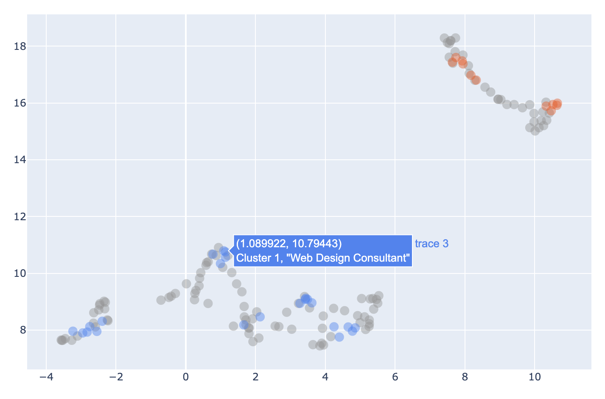

# Text clustering: HDBSCAN is probably all you need

 
 
 

---

## Resources 

* Dataset: [fka/awesome-chatgpt-prompts](https://huggingface.co/datasets/fka/awesome-chatgpt-prompts)
* Embedding Model: [sentence-transformers/all-mpnet-base-v2](https://huggingface.co/sentence-transformers/all-mpnet-base-v2)

## Experiments

`experiment_02_09_2023_16_54_32`

### Exemplar point analysis

**Figure 1**. Identifying the most persistent points in each leaf cluster - the "exemplars". These represent the cluster "hearts" around which the ultimate cluster formed.

* See [hdbscan docs](https://hdbscan.readthedocs.io/en/latest/soft_clustering_explanation.html#distance-based-membership) for more information