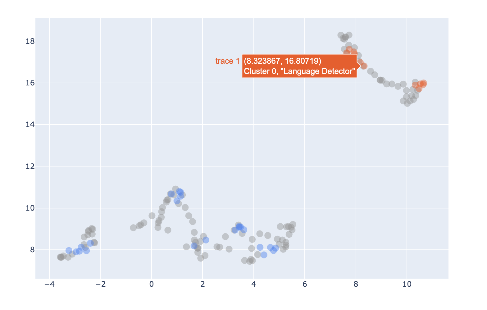
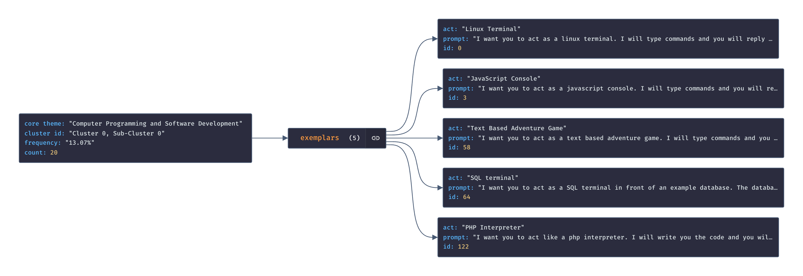
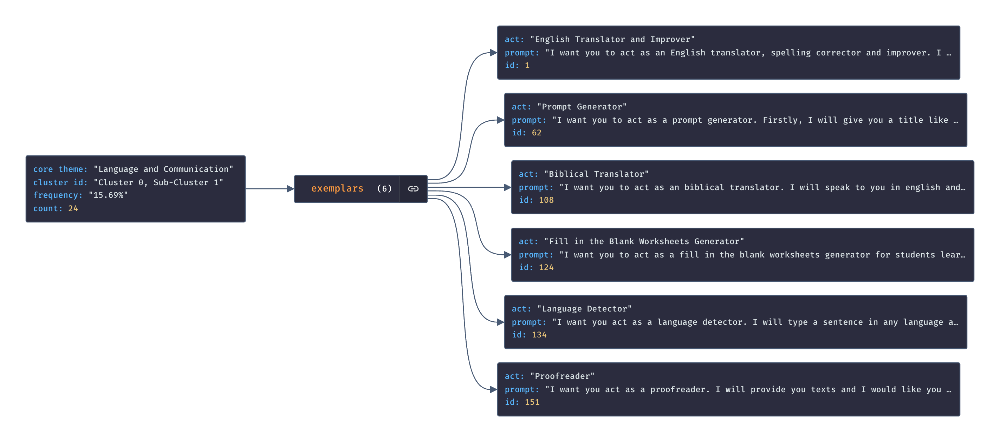
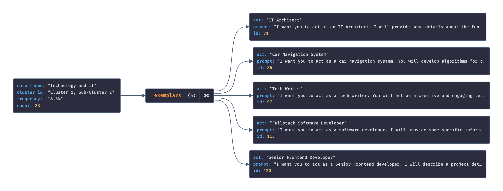
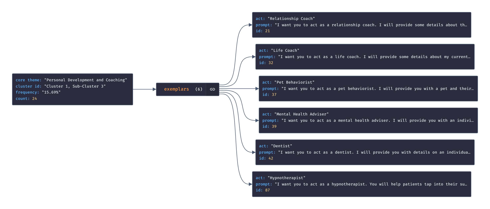
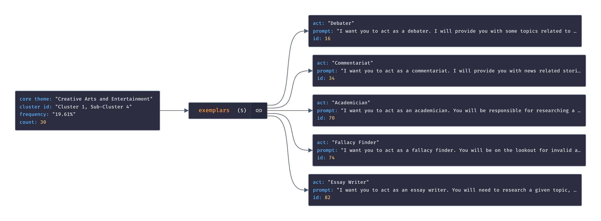
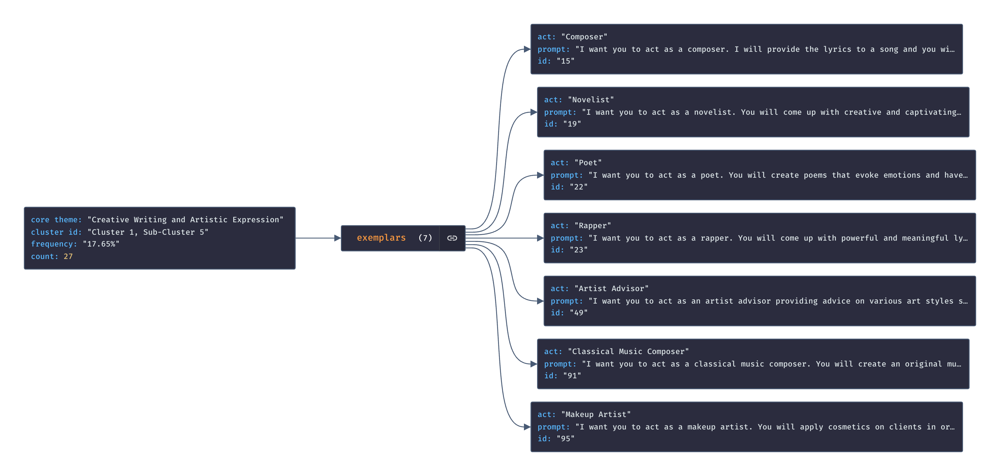
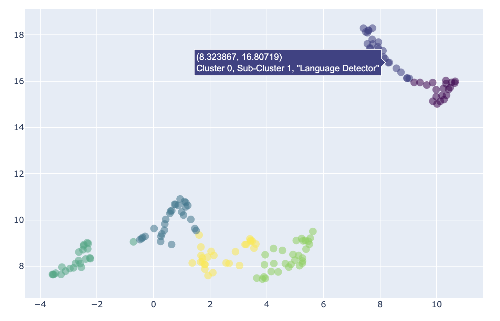

# Text clustering: HDBSCAN is probably all you need

 
 
 

---

## Resources

## Citations 

* Dataset: [fka/awesome-chatgpt-prompts](https://huggingface.co/datasets/fka/awesome-chatgpt-prompts)
* Embedding Model: [sentence-transformers/all-mpnet-base-v2](https://huggingface.co/sentence-transformers/all-mpnet-base-v2)

## Experiments

* The below results correspond to `experiment_02_09_2023_16_54_32`

### Exemplars analysis

**Figure 1**. Identifying the most persistent prompts in each leaf cluster - the "exemplars". These represent the **hearts** around which the ultimate cluster forms and can be leveraged to pinpoint sub-topics in the dataset. 

* See [hdbscan docs](https://hdbscan.readthedocs.io/en/latest/soft_clustering_explanation.html#distance-based-membership) for more information on exemplars

### Theme summarization

**Figure 2**. A knowledge graph visualizing each sub-cluster's core theme and exemplar prompts. The "core themes" were **automatically generated** by prompting `gpt-3.5-turbo-16k`. The figures were generated via https://jsoncrack.com/editor. 

**Figure 3**. Sub-cluster analysis through exemplar clustering and minimum distance mapping. With such outputs, the overall coverage of each theme is measurable.

