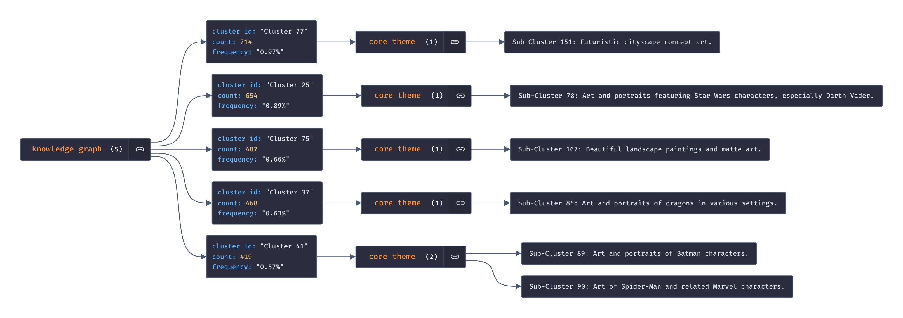

# Text clustering: HDBSCAN is probably all you need

 
 
 

## Goal

Segment common items in a text dataset to pinpoint core themes and their distribution. 

* Clusters cover the main topics/subtopics in the dataset
* Clusters backed by [gpt-3.5-turbo-16k](https://platform.openai.com/docs/models/gpt-3-5) generated summaries

## Background

We employ [HDBSCAN](https://hdbscan.readthedocs.io/en/latest/index.html) for probabilistic clustering. This algorithm is advantageous in many ways, including:

* Don’t be wrong: Cluster can have varying densities, don’t need to be globular, and won’t include noise
* Intuitive parameters: Choosing a minimum cluster size is very reasonable, and the number of *k* clusters does not need to be specified (HDBSCAN finds the optimal *k* for you)
* Stability: HDBSCAN is stable over runs and subsampling and has good stability over parameter choices
* Performance: When implemented well HDBSCAN can be very efficient; the current implementation has similar performance to fastcluster’s agglomerative clustering

See the HDBSCAN docs on [comparing clustering algorithms](https://hdbscan.readthedocs.io/en/latest/comparing_clustering_algorithms.html#hdbscan) and [how hdbscan works](https://hdbscan.readthedocs.io/en/latest/how_hdbscan_works.html) for more information.

## Citations

* Datasets
    * [fka/awesome-chatgpt-prompts](https://huggingface.co/datasets/fka/awesome-chatgpt-prompts)
    * [gustavosta/stable-diffusion-prompts](https://huggingface.co/datasets/Gustavosta/Stable-Diffusion-Prompts)  
* Embedding models
    * [sentence-transformers/all-mpnet-base-v2](https://huggingface.co/sentence-transformers/all-mpnet-base-v2)

## Experiments

### 1. Visualizing core themes in [fka/awesome-chatgpt-prompts](https://huggingface.co/datasets/fka/awesome-chatgpt-prompts)

These figures correspond to [`experiments/02_09_2023_16_54_32`](https://github.com/daniel-furman/awesome-chatgpt-prompts-clustering/tree/main/experiments/02_09_2023_16_54_32)

<a target="_blank" href="https://colab.research.google.com/github/daniel-furman/awesome-chatgpt-prompts-clustering/blob/main/notebooks/awesome-chatgpt-prompts-clustering.ipynb"> 

---

**Figure 1**. HDBSCAN splits these 153 ChatGPT prompts into two clusters: Cluster 1 with 44 prompts (orange) and Cluster 2 with 105 prompts (blue). The 4 remaining prompts (gray) were filtered out as outliers/noise.

**Figure 2**. The most persistent prompts in each leaf cluster are known as "exemplars". These represent the hearts around which the ultimate cluster formed. See the HDBSCAN docs on [soft clustering explanation](https://hdbscan.readthedocs.io/en/latest/soft_clustering_explanation.html#distance-based-membership) for supporting information and functions.

**Figure 3**. Additional clustering is conducted around the exemplars to identify sub-topics in the dataset. The cases in each sub-cluster then serve as context for the [gpt-3.5-turbo-16k](https://platform.openai.com/docs/models/gpt-3-5) calls below.

**Figure 4**. A visualization of the dataset's core themes, which were generated by [gpt-3.5-turbo-16k](https://platform.openai.com/docs/models/gpt-3-5). The above was created with [jsoncrack.com/editor](https://jsoncrack.com/editor).

 

### 2. Drift detection for [gustavosta/stable-diffusion-prompts](https://huggingface.co/datasets/Gustavosta/Stable-Diffusion-Prompts)

These figures correspond to [`experiments/04_09_2023_03_02_25`](https://github.com/daniel-furman/awesome-chatgpt-prompts-clustering/tree/main/experiments/04_09_2023_03_02_25)

---

HDBSCAN splits these 73,718 Stable Diffusion prompts into 78 clusters with 25,019 (33%) of the dataset represented. The remaining 48,699 (66%) were filtered out as outliers/noise. The 25 largest clusters cover 21% of the dataset - these are the segments we will examine in this experiment. 

**Figure 5**. A visualization of 5 sample themes from the dataset. The summaries were generated by [claude-2](https://claude.ai/chats). The above was created with [jsoncrack.com/editor](https://jsoncrack.com/editor).

| cluster id | train count  | claude-2 summary                                                                                           |
|------------|--------------|------------------------------------------------------------------------------------------------------------|
| 56         | 2530 (3.43%) | Portraits and artistic depictions of female anime characters, beautiful women, and fashionable young women |
| 13         | 1343 (1.82%) | Symmetrical portraits of people, characters, and sci-fi figures                                            |
| 61         | 1287 (1.75%) | Futuristic sci-fi spaceship concept art                                                                    |
| 50         | 1055 (1.43%) | Portraits of famous actresses as characters in various roles, outfits, and styles                          |
| 74         | 749 (1.02%)  | Surreal, cinematic, and futuristic digital art                                                             |

**Table 1**. 

**Table 2**. 

 

  

Prompt: "*Beautiful painting of an Aspen forest at sunset, digital art, award winning illustration, golden hour, smooth, sharp lines, concept art, trending on artstation*"  
Model: [Runway Gen-2](https://app.runwayml.com/video-tools/teams/dryanfurman/ai-tools/text-to-image) (accessed Sep 4, 2023)  
Cluster 75, Sub-Cluster 167: "Beautiful landscape paintings and matte art"   

 

  

Prompt: "*Futuristic batman, brush strokes, oil painting, greg rutkowski*"  
Model: [Midjourney V5.2](https://www.midjourney.com/app/) (accessed Sep 4, 2023)  
Cluster 41, Sub-Cluster 89: "Art and portraits of Batman characters"  

  

Prompt: "*Futuristic Porsche designed by Apple, a detailed matte painting by Kitagawa Utamaro, cgsociety, octane render, highly detailed, matte painting, concept art, sci-fi*"  
Model: [Midjourney V5.2](https://www.midjourney.com/app/) (accessed Sep 4, 2023)  
Cluster 52, Sub-Cluster 84: "Futuristic and fantasy vehicle concept art."   

 

**Figure 6**. 